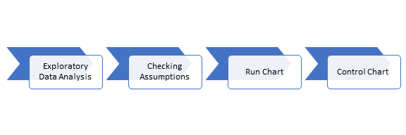

# (PART) Part II {-}
# Case Study {#case_study}

Rachel is a completely fictional character created for this book. She is a business analyst working in the healthcare industry. Over the next few chapters we will follow Rachel through the SPC process using her datasets (also fictional; the code used to create the datasets are available in the appendix).

Be on the look out for boxes like below. These are checkpoints that will help evaluate your understanding of the material. Let's try one now. Recall what you read about stability in the previous chapter to answer the following questions:

*** 

```{remark}
\nop

\vspace{12pt}
\vspace{12pt}

* Scenario 1: Rachel's company has recently implemented a new procedure to reduce the amount of time that patients wait to seen. Her superiors want to know if the change has been effective. 

* Scenario 2: Rachel's company is proud that they have the shortest wait times in the state. They want Rachel to monitor patient wait-times to ensure that they do not slip. 

Are these stable processes? Can Rachel use control charts?  
  
\vspace{12pt}
```

***

SPC tools are built upon the fundamental assumption of a *stable* process. 

<br>
\vspace{12pt}

* Scenario 1: Is this a stable process? No, because we expect that the wait time will decrease. Control charts are only applicable when the business goal is to keep that KPI stable. Rachel must define the KPI in terms of something we would want to remain stable in order to proceed with the SPC process. This could be a frequency count of wait times over 45 minutes. 

* Scenario 2: Is this a stable process? Yes, because we know that wait times have been stable and we expect them to remain stable. 

<br>
\vspace{12pt}

Ensuring that the KPI is stable is foundational. Rachel cannot simply graph the control chart at this point (see Mistake #3 in the previous chapter). You must go through each step in the SPC process: 

<br>
\vspace{12pt}

```{r process_flow, echo = FALSE, fig.align = "center", fig.width=5}

```

<br>
\vspace{12pt}

<br>
\vspace{12pt}

Rachel has a dataset of CLABSI (central line associated blood stream infection) data for her hospital, which can be seen below. 

```{r head_data, fig.height=3, fig.align='center', echo=FALSE}
# Set seed for reproducibility
set.seed(2019)

# Generate fake infections data
dates <- strftime(seq(as.Date("2013/10/1"), by = "day", length.out = 730), "%Y-%m-01")
linedays <- sample(30:60,length(dates), replace = TRUE)
infections <- rpois(length(dates), 2/1000*linedays)


# Aggregate the data by month
infections <- aggregate(infections, by = list(dates), FUN = sum, na.rm = TRUE)$x
linedays <- aggregate(linedays, by = list(dates), FUN = sum, na.rm = TRUE)$x
months <- unique(dates)

# Create a tibble
rachel_data = tibble(months, infections, linedays)

# For pretty table
pretty_data <- rachel_data
pretty_data$months <- as.character(pretty_data$months)
pretty_data$infections <- as.character(pretty_data$infections)
pretty_data$linedays <- as.character(pretty_data$linedays)

pretty_table <- bind_rows(head(pretty_data, 3), tibble(months = '...', infections ='...', linedays ='...'), tail(pretty_data, 3))
pander::pander(pretty_table, style = 'rmarkdown')
```

Rachel and her team want to ensure that the CLABSI count is stable. In the next chapter we will help Rachel with exploratory data analysis for this dataset.


